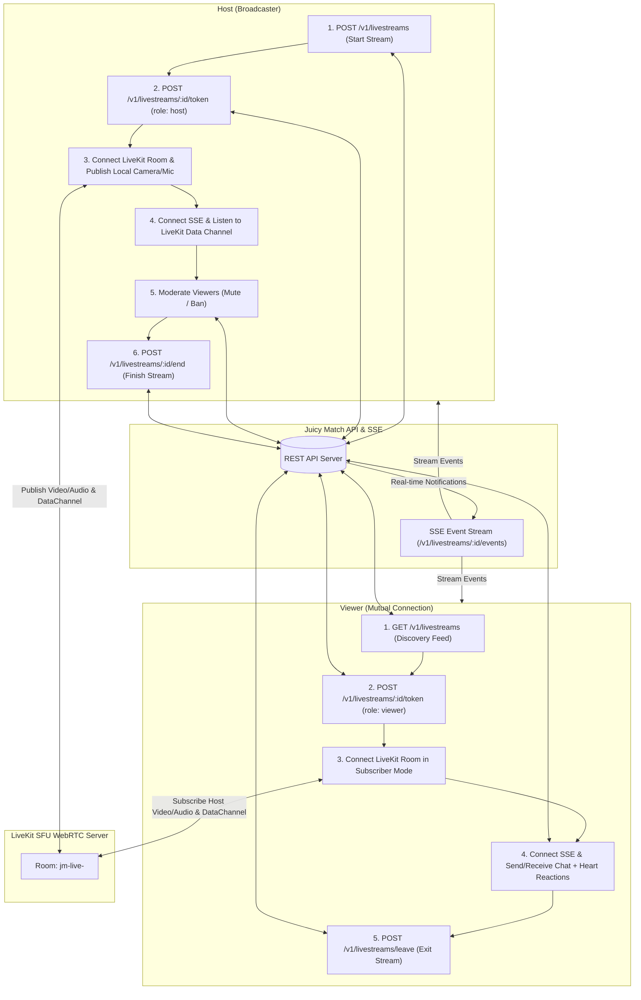

# Juicy Match — Go Live (Livestreaming) End-to-End Documentation & Integration Guide

This document provides a comprehensive, production-grade guide to the **Go Live (Livestreaming)** system in Juicy Match. It contains all architectural flows, complete REST API endpoints, real-time Server-Sent Events (SSE), WebRTC LiveKit integration, Data Channel zero-latency messaging, interactive micro-features (floating hearts, live moderation, viewer counts), and drop-in React components.

---

## 1. System Architecture & Flow

Juicy Match livestreaming allows members to broadcast live video/audio to their **active mutual connections**. It is a private, one-to-many broadcast (one creator/host to multiple connection viewers) with synchronized live text chat, floating heart reactions, viewer tracking, and real-time moderation.



### Key Architectural Rules
1. **Mutual Connection Privacy**: A viewer can discover, view, and chat in a stream **only** if they share an `active` mutual connection with the creator.
2. **Block Enforcement**: Any block in either direction instantly revokes access, disconnects the viewer, and hides the stream from discovery feeds.
3. **Single Active Stream Constraint**: A host can have at most one active livestream. Attempting to start a second returns HTTP `409 Conflict`.
4. **Zero Server Recording**: Broadcasts are ephemeral and secure; no server-side video recording or egress is stored.
5. **LiveKit Token Expiry**: LiveKit tokens expire in 10 minutes (`10m`). If disconnected unexpectedly, the client requests a fresh token and reconnects.
6. **Auto-Cleanup**: Streams without an explicit end call are automatically cleaned up after 4 hours.

---

## 2. Enums, Models & Constants

### Enums

#### `LivestreamState`
```typescript
export enum LivestreamState {
  LIVE = "live",
  ENDED = "ended",
  TERMINATED = "terminated"
}
```

#### `LivestreamRole`
```typescript
export enum LivestreamRole {
  HOST = "host",
  VIEWER = "viewer"
}
```

#### `LivestreamReportReason`
```typescript
export enum LivestreamReportReason {
  HARASSMENT = "harassment",
  IMPERSONATION = "impersonation",
  UNWANTED_MEDIA = "unwanted-media",
  OTHER = "other"
}
```

#### `LivestreamSSEEventType`
```typescript
export enum LivestreamSSEEventType {
  READY = "ready",                           // Connection established
  LIVESTREAM_STARTED = "livestream.started", // Mutual connection went live
  LIVESTREAM_VIEWERS = "livestream.viewers", // Viewer count changed
  LIVESTREAM_MESSAGE = "livestream.message", // New chat message posted
  LIVESTREAM_MODERATION = "livestream.moderation", // Viewer muted/unmuted
  LIVESTREAM_BANNED = "livestream.banned",   // Viewer banned by host
  LIVESTREAM_ENDED = "livestream.ended"      // Host ended the stream
}
```

---

## 3. Complete REST API Reference

All endpoints requiring member authentication use the standard header:
`Authorization: Bearer <accessToken>`

---

### 3.1. Check Livestream Mode
Checks if livestreaming is enabled on the platform and if the LiveKit RTC provider is active.

- **Method**: `GET`
- **Path**: `/v1/livestreams/mode`
- **Auth**: Optional

#### Response (`200 OK`)
```json
{
  "mode": "livekit",
  "enabled": true
}
```

---

### 3.2. List Active Livestreams (Discovery Feed)
Fetches active livestreams hosted by the authenticated user's mutual connections.

- **Method**: `GET`
- **Path**: `/v1/livestreams`
- **Auth**: Required

#### Response (`200 OK`)
```json
{
  "items": [
    {
      "id": "e4b1bf76-788e-4a65-9eb2-f3f2dbd637c1",
      "title": "Evening Chill & Q&A Session ✨",
      "creator": "8d3e9619-3e3c-4444-a690-33671239bc74",
      "pseudonym": "Aashik",
      "viewerCount": 14,
      "peakViewers": 18,
      "startedAt": "2026-10-08T10:30:00.000Z"
    }
  ],
  "mode": "livekit"
}
```

---

### 3.3. Start Livestream (Host)
Creates a new livestream broadcast room.

- **Method**: `POST`
- **Path**: `/v1/livestreams`
- **Auth**: Required

#### Request Body
```json
{
  "title": "Evening Chill & Q&A Session ✨"
}
```

#### Response (`201 Created`)
```json
{
  "id": "e4b1bf76-788e-4a65-9eb2-f3f2dbd637c1",
  "title": "Evening Chill & Q&A Session ✨",
  "state": "live",
  "roomName": "jm-live-e4b1bf76-788e-4a65-9eb2-f3f2dbd637c1",
  "startedAt": "2026-10-08T10:30:00.000Z"
}
```

---

### 3.4. Mint LiveKit WebRTC Access Token
Generates a signed JWT token to connect to LiveKit SFU.
- **Host**: Can publish camera, microphone, screen share, and data channel.
- **Viewer**: Subscribes to host video/audio and can publish data channel messages.

- **Method**: `POST`
- **Path**: `/v1/livestreams/:id/token`
- **Auth**: Required

#### Response (`200 OK`)
```json
{
  "url": "wss://live.juicymatch.ai",
  "token": "eyJhbGciOiJIUzI1NiIsInR5cCI6IkpXVCJ9...",
  "role": "host",
  "streamId": "e4b1bf76-788e-4a65-9eb2-f3f2dbd637c1",
  "roomName": "jm-live-e4b1bf76-788e-4a65-9eb2-f3f2dbd637c1",
  "viewerCount": 1
}
```

---

### 3.5. Get Livestream Details
Fetches active state, room details, and viewer statistics.

- **Method**: `GET`
- **Path**: `/v1/livestreams/:id`
- **Auth**: Required

#### Response (`200 OK`)
```json
{
  "id": "e4b1bf76-788e-4a65-9eb2-f3f2dbd637c1",
  "title": "Evening Chill & Q&A Session ✨",
  "state": "live",
  "creator": "8d3e9619-3e3c-4444-a690-33671239bc74",
  "isHost": true,
  "roomName": "jm-live-e4b1bf76-788e-4a65-9eb2-f3f2dbd637c1",
  "viewerCount": 14,
  "peakViewers": 18,
  "totalViewers": 42,
  "startedAt": "2026-10-08T10:30:00.000Z",
  "endedAt": null
}
```

---

### 3.6. End Livestream (Host)
Closes the broadcast, disconnects all participants, and emits `livestream.ended`.

- **Method**: `POST`
- **Path**: `/v1/livestreams/:id/end`
- **Auth**: Required (Must be creator)

#### Response (`200 OK`)
```json
{
  "id": "e4b1bf76-788e-4a65-9eb2-f3f2dbd637c1",
  "state": "ended"
}
```

---

### 3.7. Leave Livestream (Viewer)
Notifies the backend that a viewer has exited so viewer count decrements immediately.

- **Method**: `POST`
- **Path**: `/v1/livestreams/leave`
- **Auth**: Required

#### Request Body
```json
{
  "streamId": "e4b1bf76-788e-4a65-9eb2-f3f2dbd637c1"
}
```

#### Response (`200 OK`)
```json
{
  "ok": true
}
```

---

### 3.8. Fetch Live Chat Messages (Cursor Paginated)
Fetches chronological messages.

- **Method**: `GET`
- **Path**: `/v1/livestreams/:id/messages?after=<cursor>&limit=100`
- **Auth**: Required

#### Response (`200 OK`)
```json
{
  "items": [
    {
      "id": "76d8b671-5509-41ef-bb66-4e5a953e5066",
      "sender": "91a56658-ec37-4d4d-9a67-0c7f12e11894",
      "pseudonym": "Jordan",
      "body": "Hey everyone! 👋",
      "createdAt": "2026-10-08T10:32:15.120Z"
    }
  ],
  "nextAfter": "2026-10-08T10:32:15.120Z|76d8b671-5509-41ef-bb66-4e5a953e5066"
}
```

---

### 3.9. Post Chat Message or Reaction
Sends a chat comment or reaction emoji.

- **Method**: `POST`
- **Path**: `/v1/livestreams/:id/messages`
- **Auth**: Required

#### Request Body
```json
{
  "body": "Love the vibe! ❤️",
  "clientId": "f90b29c1-7f91-4cf1-8c44-e2b20242a8a1"
}
```

#### Response (`201 Created`)
```json
{
  "id": "89e1a234-bcde-4f01-9012-3456789abcde",
  "body": "Love the vibe! ❤️",
  "createdAt": "2026-10-08T10:33:00.450Z"
}
```

---

### 3.10. Mute / Unmute Viewer (Host Action)
Muting prevents the viewer from posting chat comments and mutes their presence.

- **Method**: `POST`
- **Path**: `/v1/livestreams/:id/viewers/:viewerId/mute`
- **Auth**: Required (Host only)

#### Request Body
```json
{
  "muted": true
}
```

#### Response (`200 OK`)
```json
{
  "ok": true,
  "viewer": "91a56658-ec37-4d4d-9a67-0c7f12e11894",
  "muted": true
}
```

---

### 3.11. Ban Viewer (Host Action)
Permanently kicks the viewer from this livestream room and forbids re-entry.

- **Method**: `POST`
- **Path**: `/v1/livestreams/:id/viewers/:viewerId/ban`
- **Auth**: Required (Host only)

#### Response (`200 OK`)
```json
{
  "ok": true,
  "viewer": "91a56658-ec37-4d4d-9a67-0c7f12e11894",
  "banned": true
}
```

---

### 3.12. Report Livestream (Viewer Action)
Submits a report to Trust & Safety.

- **Method**: `POST`
- **Path**: `/v1/livestreams/:id/report`
- **Auth**: Required

#### Request Body
```json
{
  "reason": "harassment"
}
```

#### Response (`201 Created`)
```json
{
  "id": "a98cb3d7-463d-4c3e-b816-163e77f09f08",
  "state": "open"
}
```

---

### 3.13. Request SSE Ticket & Connect
Because standard browser `EventSource` cannot attach custom headers, you request a single-use 60-second ticket first.

1. **Mint Ticket**:
   - **Method**: `POST`
   - **Path**: `/v1/livestreams/:id/events-ticket`
   - **Response**: `{"ticket": "c8f2b1d6-8488-466d-b89e-4c7490089a87", "expiresIn": 60}`

2. **Connect SSE**:
   - **Method**: `GET`
   - **Path**: `/v1/livestreams/:id/events?ticket=<ticket>`

---

## 4. Real-Time Server-Sent Events (SSE) Payloads

| Event Name | Description | Example Payload |
|---|---|---|
| `ready` | Initial connection state | `{"type": "ready", "streamId": "...", "viewerCount": 12}` |
| `livestream.started` | Connection started a stream | `{"type": "livestream.started", "streamId": "...", "creator": "...", "title": "..."}` |
| `livestream.viewers` | Viewer count updated | `{"type": "livestream.viewers", "streamId": "...", "viewerCount": 15}` |
| `livestream.message` | Chat comment received | `{"type": "livestream.message", "streamId": "...", "id": "...", "sender": "...", "pseudonym": "Jordan", "body": "Hello!", "createdAt": "..."}` |
| `livestream.moderation`| Viewer muted/unmuted | `{"type": "livestream.moderation", "streamId": "...", "viewer": "...", "muted": true}` |
| `livestream.banned` | Viewer banned from room | `{"type": "livestream.banned", "streamId": "...", "viewer": "..."}` |
| `livestream.ended` | Host ended the stream | `{"type": "livestream.ended", "streamId": "..."}` |

---

## 5. Zero-Latency WebRTC Data Channel Sync

In addition to SSE and backend REST persistence, Juicy Match utilizes **LiveKit WebRTC Data Channels** (`room.localParticipant.publishData`) for instantaneous, sub-50ms peer synchronization:

```javascript
// 1. Sending Chat Message over Data Channel
const chatPayload = JSON.stringify({
  type: 'chat',
  id: Date.now().toString(),
  senderId: user.id,
  senderName: user.pseudonym || user.name,
  senderPortrait: user.portrait || 0,
  text: 'Love the stream! ✨',
  timestamp: new Date().toISOString()
});
room.localParticipant.publishData(new TextEncoder().encode(chatPayload), { reliable: true });

// 2. Sending Floating Heart Reaction
const heartPayload = JSON.stringify({ type: 'heart' });
room.localParticipant.publishData(new TextEncoder().encode(heartPayload), { reliable: false });
```

---

## 6. Small Interactive Features Breakdown

1. **Floating Hearts Animation**:
   - Tapping the ❤️ floating button immediately spawns vibrant floating particles (`#E91671`, `#FF4081`, `#FF82B5`, `#D946EF`) that drift upward with random horizontal sway and fade out after 3 seconds.
   - Triggers WebRTC Data Channel broadcast to render floating hearts on all connected viewers' and host's screens in real time.
2. **Viewer Count & Peak Viewers**:
   - Calculated dynamically from `max(backendViewerCount, room.remoteParticipants.length + 1)`.
   - Host header displays: `👁️ 14 | 📈 Peak: 18`.
3. **Host Moderation Menu**:
   - Clicking on any viewer's chat comment opens a moderation bottom sheet/modal.
   - Host can:
     - View Viewer Profile
     - Mute / Unmute Viewer from Chat
     - Ban Viewer Permanently from the Live Broadcast
4. **Camera & Microphone Controls (Host)**:
   - Microphone toggle: Mute/unmute local audio track (`localParticipant.setMicrophoneEnabled(bool)`).
   - Camera toggle: Turn off/on local video feed.
   - Camera switch/flip: Switch between front facing and environment cameras (or selectable video inputs in browser).
5. **Stream Summary Screen (Host)**:
   - Upon ending the stream via `POST /v1/livestreams/:id/end`, show a congratulatory stats modal displaying:
     - ⏱️ Total Stream Duration
     - 👥 Total Unique Viewers
     - 📈 Peak Concurrent Viewers
     - 💬 Total Chat Messages Sent

---

## 7. React Web Frontend Implementation

Below are the complete, ready-to-use React services, custom hooks, and components to drop into your React project (`src/services` and `src/components/views`).

### 7.1. Livestream Service (`src/services/liveStreamService.js`)

```javascript
import { API_BASE_URL, getAuthToken } from '../config';

const getHeaders = () => {
  const token = getAuthToken();
  return {
    'Content-Type': 'application/json',
    ...(token ? { Authorization: `Bearer ${token}` } : {})
  };
};

export const liveStreamService = {
  // Check Mode
  checkMode: async () => {
    try {
      const res = await fetch(`${API_BASE_URL}/v1/livestreams/mode`);
      return await res.json();
    } catch (_) {
      return { mode: 'disabled', enabled: false };
    }
  },

  // Discovery Feed
  fetchActiveStreams: async () => {
    const res = await fetch(`${API_BASE_URL}/v1/livestreams`, { headers: getHeaders() });
    if (!res.ok) throw new Error('Failed to fetch livestreams');
    const data = await res.json();
    return data.items || [];
  },

  // Stream Details
  getStreamDetails: async (streamId) => {
    const res = await fetch(`${API_BASE_URL}/v1/livestreams/${streamId}`, { headers: getHeaders() });
    if (!res.ok) throw new Error('Failed to fetch stream details');
    return await res.json();
  },

  // Host: Start Broadcast
  startStream: async (title) => {
    const res = await fetch(`${API_BASE_URL}/v1/livestreams`, {
      method: 'POST',
      headers: getHeaders(),
      body: JSON.stringify({ title })
    });
    if (!res.ok) {
      const err = await res.json().catch(() => ({}));
      throw new Error(err.error || 'Failed to start live stream');
    }
    return await res.json();
  },

  // Host: End Broadcast
  endStream: async (streamId) => {
    const res = await fetch(`${API_BASE_URL}/v1/livestreams/${streamId}/end`, {
      method: 'POST',
      headers: getHeaders()
    });
    return await res.json();
  },

  // Mint LiveKit Access Token
  mintToken: async (streamId) => {
    const res = await fetch(`${API_BASE_URL}/v1/livestreams/${streamId}/token`, {
      method: 'POST',
      headers: getHeaders()
    });
    if (!res.ok) {
      const err = await res.json().catch(() => ({}));
      throw new Error(err.error || 'Failed to mint livestream token');
    }
    return await res.json();
  },

  // Viewer: Leave Stream
  leaveStream: async (streamId) => {
    try {
      await fetch(`${API_BASE_URL}/v1/livestreams/leave`, {
        method: 'POST',
        headers: getHeaders(),
        body: JSON.stringify({ streamId })
      });
    } catch (_) {}
  },

  // Fetch Chat Messages
  fetchMessages: async (streamId, after = null, limit = 100) => {
    const url = after 
      ? `${API_BASE_URL}/v1/livestreams/${streamId}/messages?after=${encodeURIComponent(after)}&limit=${limit}`
      : `${API_BASE_URL}/v1/livestreams/${streamId}/messages?limit=${limit}`;
    const res = await fetch(url, { headers: getHeaders() });
    if (!res.ok) return { items: [], nextAfter: null };
    return await res.json();
  },

  // Send Chat Message
  sendChatMessage: async (streamId, text) => {
    const clientId = crypto.randomUUID ? crypto.randomUUID() : Date.now().toString();
    const res = await fetch(`${API_BASE_URL}/v1/livestreams/${streamId}/messages`, {
      method: 'POST',
      headers: getHeaders(),
      body: JSON.stringify({ body: text, clientId })
    });
    if (!res.ok) {
      const err = await res.json().catch(() => ({}));
      throw new Error(err.error || 'Failed to send chat message');
    }
    return await res.json();
  },

  // Host Moderation: Mute Viewer
  muteViewer: async (streamId, viewerId, muted = true) => {
    const res = await fetch(`${API_BASE_URL}/v1/livestreams/${streamId}/viewers/${viewerId}/mute`, {
      method: 'POST',
      headers: getHeaders(),
      body: JSON.stringify({ muted })
    });
    return await res.json();
  },

  // Host Moderation: Ban Viewer
  banViewer: async (streamId, viewerId) => {
    const res = await fetch(`${API_BASE_URL}/v1/livestreams/${streamId}/viewers/${viewerId}/ban`, {
      method: 'POST',
      headers: getHeaders()
    });
    return await res.json();
  },

  // Viewer Action: Report Stream
  reportStream: async (streamId, reason) => {
    const res = await fetch(`${API_BASE_URL}/v1/livestreams/${streamId}/report`, {
      method: 'POST',
      headers: getHeaders(),
      body: JSON.stringify({ reason })
    });
    return await res.json();
  },

  // Request SSE Ticket
  requestSseTicket: async (streamId) => {
    const res = await fetch(`${API_BASE_URL}/v1/livestreams/${streamId}/events-ticket`, {
      method: 'POST',
      headers: getHeaders()
    });
    return await res.json();
  }
};
```

---

### 7.2. SSE Hook (`src/hooks/useLiveStreamSSE.js`)

```javascript
import { useEffect, useRef } from 'react';
import { liveStreamService } from '../services/liveStreamService';
import { API_BASE_URL } from '../config';

export function useLiveStreamSSE(streamId, onEvent) {
  const eventSourceRef = useRef(null);

  useEffect(() => {
    if (!streamId) return;
    let isCancelled = false;

    async function connectSSE() {
      try {
        const { ticket } = await liveStreamService.requestSseTicket(streamId);
        if (isCancelled || !ticket) return;

        const url = `${API_BASE_URL}/v1/livestreams/${streamId}/events?ticket=${ticket}`;
        const es = new EventSource(url);
        eventSourceRef.current = es;

        const eventTypes = [
          'ready',
          'livestream.started',
          'livestream.viewers',
          'livestream.message',
          'livestream.moderation',
          'livestream.banned',
          'livestream.ended'
        ];

        eventTypes.forEach((type) => {
          es.addEventListener(type, (e) => {
            try {
              const data = JSON.parse(e.data);
              onEvent({ type, ...data });
            } catch (_) {}
          });
        });

        es.onerror = () => {
          es.close();
        };
      } catch (err) {
        console.error('SSE connect error:', err);
      }
    }

    connectSSE();

    return () => {
      isCancelled = true;
      if (eventSourceRef.current) {
        eventSourceRef.current.close();
        eventSourceRef.current = null;
      }
    };
  }, [streamId]);
}
```

---

### 7.3. Floating Hearts Particle Component (`src/components/LiveStream/FloatingHearts.jsx`)

```jsx
import React from 'react';

const COLORS = ['#E91671', '#FF4081', '#FF82B5', '#D946EF', '#A855F7'];

export default function FloatingHearts({ hearts }) {
  return (
    <div className="absolute inset-0 pointer-events-none overflow-hidden z-20">
      {hearts.map((h) => (
        <div
          key={h.id}
          className="absolute bottom-20 animate-float-heart text-2xl select-none"
          style={{
            right: `${h.right || 24}px`,
            color: h.color || COLORS[Math.floor(Math.random() * COLORS.length)],
            transform: `scale(${h.scale || 1})`
          }}
        >
          ❤️
        </div>
      ))}
      <style jsx>{`
        @keyframes floatHeart {
          0% {
            opacity: 1;
            transform: translateY(0) scale(0.8) rotate(0deg);
          }
          50% {
            transform: translateY(-120px) scale(1.2) rotate(15deg);
          }
          100% {
            opacity: 0;
            transform: translateY(-260px) scale(1.4) rotate(-15deg);
          }
        }
        .animate-float-heart {
          animation: floatHeart 2.5s ease-out forwards;
        }
      `}</style>
    </div>
  );
}
```

---

### 7.4. Live Chat Overlay Component (`src/components/LiveStream/LiveChatOverlay.jsx`)

```jsx
import React, { useRef, useEffect } from 'react';
import { Shield, VolumeX, Ban, User } from 'lucide-react';

export default function LiveChatOverlay({
  messages = [],
  isHost = false,
  isMuted = false,
  chatText = '',
  onChatTextChange = () => {},
  onSendMessage = () => {},
  onSendHeart = () => {},
  onModerateUser = () => {}
}) {
  const scrollRef = useRef(null);

  useEffect(() => {
    if (scrollRef.current) {
      scrollRef.current.scrollTop = scrollRef.current.scrollHeight;
    }
  }, [messages]);

  return (
    <div className="flex flex-col justify-end h-full p-4 pointer-events-none z-10">
      {/* Messages Scroll Area */}
      <div
        ref={scrollRef}
        className="max-h-64 overflow-y-auto space-y-2 pointer-events-auto pr-2 scrollbar-none flex flex-col justify-end"
      >
        {messages.map((msg) => {
          if (msg.isSystem) {
            return (
              <div
                key={msg.id}
                className="bg-black/50 backdrop-blur-md px-3 py-1.5 rounded-full text-xs text-amber-300 font-medium self-start border border-amber-500/20"
              >
                {msg.text || msg.body}
              </div>
            );
          }

          return (
            <div
              key={msg.id}
              onClick={() => isHost && onModerateUser(msg)}
              className={`bg-black/45 backdrop-blur-md px-3 py-2 rounded-2xl max-w-[85%] self-start border border-white/10 transition-all ${
                isHost ? 'cursor-pointer hover:bg-black/60 hover:border-pink-500/40' : ''
              }`}
            >
              <span className="text-pink-400 font-semibold text-xs mr-2">
                {msg.senderName || msg.pseudonym || 'Viewer'}:
              </span>
              <span className="text-white text-xs leading-relaxed break-words">
                {msg.text || msg.body}
              </span>
            </div>
          );
        })}
      </div>

      {/* Chat Input & Floating Heart Trigger */}
      <div className="mt-3 flex items-center gap-2 pointer-events-auto">
        <form
          onSubmit={(e) => {
            e.preventDefault();
            onSendMessage();
          }}
          className="flex-1 flex items-center bg-black/60 backdrop-blur-lg rounded-full px-4 py-2 border border-white/20 focus-within:border-pink-500"
        >
          <input
            type="text"
            value={chatText}
            disabled={isMuted}
            onChange={(e) => onChatTextChange(e.target.value)}
            placeholder={isMuted ? 'You are muted in this live stream 🔇' : 'Add a comment...'}
            className="w-full bg-transparent text-white text-xs placeholder:text-zinc-400 outline-none disabled:opacity-50"
          />
          <button
            type="submit"
            disabled={!chatText.trim() || isMuted}
            className="text-pink-500 font-bold text-xs ml-2 disabled:opacity-30 hover:scale-105 transition-transform"
          >
            Send
          </button>
        </form>

        <button
          type="button"
          onClick={onSendHeart}
          className="w-10 h-10 rounded-full bg-gradient-to-tr from-pink-600 to-rose-400 flex items-center justify-center text-xl shadow-lg hover:scale-110 active:scale-95 transition-transform"
        >
          ❤️
        </button>
      </div>
    </div>
  );
}
```

---

### 7.5. Host Live Screen Component (`src/components/views/HostLiveModal.jsx`)

```jsx
import React, { useState, useEffect, useRef } from 'react';
import { Room, RoomEvent, DataPacket_Kind } from 'livekit-client';
import { liveStreamService } from '../../services/liveStreamService';
import { useLiveStreamSSE } from '../../hooks/useLiveStreamSSE';
import FloatingHearts from '../LiveStream/FloatingHearts';
import LiveChatOverlay from '../LiveStream/LiveChatOverlay';
import { Mic, MicOff, Video, VideoOff, Users, X, Trophy, Sparkles, Shield, VolumeX, Ban } from 'lucide-react';

export default function HostLiveModal({ isOpen, onClose, user }) {
  const [step, setStep] = useState('create'); // 'create' | 'broadcasting' | 'summary'
  const [title, setTitle] = useState('Evening Chill & Q&A Session ✨');
  const [stream, setStream] = useState(null);
  const [viewerCount, setViewerCount] = useState(1);
  const [peakViewers, setPeakViewers] = useState(1);
  const [micMuted, setMicMuted] = useState(false);
  const [videoMuted, setVideoMuted] = useState(false);
  const [messages, setMessages] = useState([]);
  const [chatText, setChatText] = useState('');
  const [hearts, setHearts] = useState([]);
  const [modTargetUser, setModTargetUser] = useState(null);

  const roomRef = useRef(null);
  const videoPreviewRef = useRef(null);

  // Real-time SSE Events
  useLiveStreamSSE(stream?.id, (event) => {
    if (event.viewerCount) {
      setViewerCount((prev) => {
        const next = Math.max(prev, event.viewerCount);
        setPeakViewers((p) => Math.max(p, next));
        return next;
      });
    }
    if (event.type === 'livestream.message' && event.id) {
      setMessages((prev) => {
        if (prev.some((m) => m.id === event.id)) return prev;
        return [...prev, { ...event, text: event.body }];
      });
      if (event.body?.includes('❤️')) spawnHeart();
    }
  });

  const spawnHeart = () => {
    const newHeart = {
      id: Math.random().toString(36),
      scale: 0.8 + Math.random() * 0.6,
      right: 20 + Math.random() * 40
    };
    setHearts((prev) => [...prev, newHeart]);
    setTimeout(() => {
      setHearts((prev) => prev.filter((h) => h.id !== newHeart.id));
    }, 2500);
  };

  const handleStartBroadcast = async () => {
    try {
      const createdStream = await liveStreamService.startStream(title);
      setStream(createdStream);

      const tokenData = await liveStreamService.mintToken(createdStream.id);
      const room = new Room({
        adaptiveStream: true,
        dynacast: true
      });

      await room.connect(tokenData.url || 'wss://live.juicymatch.ai', tokenData.token);
      await room.localParticipant.setCameraEnabled(true);
      await room.localParticipant.setMicrophoneEnabled(true);

      // Attach Local Video Track
      const camTrack = Array.from(room.localParticipant.videoTrackPublications.values())[0]?.track;
      if (camTrack && videoPreviewRef.current) {
        camTrack.attach(videoPreviewRef.current);
      }

      // Listen for incoming Data Channel messages
      room.on(RoomEvent.DataReceived, (payload) => {
        try {
          const str = new TextDecoder().decode(payload);
          const data = JSON.parse(str);
          if (data.type === 'chat') {
            setMessages((prev) => [...prev, data]);
            if (data.text?.includes('❤️')) spawnHeart();
          } else if (data.type === 'heart') {
            spawnHeart();
          }
        } catch (_) {}
      });

      room.on(RoomEvent.ParticipantConnected, () => {
        const count = room.remoteParticipants.size + 1;
        setViewerCount(count);
        setPeakViewers((p) => Math.max(p, count));
      });

      room.on(RoomEvent.ParticipantDisconnected, () => {
        setViewerCount(Math.max(1, room.remoteParticipants.size + 1));
      });

      roomRef.current = room;
      setStep('broadcasting');
      setMessages([
        {
          id: 'sys-start',
          isSystem: true,
          text: '🔴 Live broadcast started! Your active connections have been notified.'
        }
      ]);
    } catch (err) {
      alert(`Could not start stream: ${err.message}`);
    }
  };

  const handleEndBroadcast = async () => {
    if (roomRef.current) {
      roomRef.current.disconnect();
    }
    if (stream?.id) {
      await liveStreamService.endStream(stream.id);
    }
    setStep('summary');
  };

  const handleToggleMic = async () => {
    if (!roomRef.current) return;
    const next = !micMuted;
    setMicMuted(next);
    await roomRef.current.localParticipant.setMicrophoneEnabled(!next);
  };

  const handleToggleVideo = async () => {
    if (!roomRef.current) return;
    const next = !videoMuted;
    setVideoMuted(next);
    await roomRef.current.localParticipant.setCameraEnabled(!next);
  };

  const handleSendMessage = async () => {
    if (!chatText.trim() || !stream) return;
    const text = chatText.trim();
    setChatText('');

    const newMsg = {
      id: Date.now().toString(),
      senderId: user?.id,
      senderName: user?.pseudonym || user?.name || 'Host',
      text,
      timestamp: new Date().toISOString()
    };

    setMessages((prev) => [...prev, newMsg]);

    // 1. Broadcast via WebRTC Data Channel
    if (roomRef.current) {
      const dataPayload = JSON.stringify({ type: 'chat', ...newMsg });
      roomRef.current.localParticipant.publishData(new TextEncoder().encode(dataPayload), { reliable: true });
    }

    // 2. Persist to DB
    await liveStreamService.sendChatMessage(stream.id, text);
  };

  const handleSendHeart = async () => {
    spawnHeart();
    if (roomRef.current) {
      const dataPayload = JSON.stringify({ type: 'heart' });
      roomRef.current.localParticipant.publishData(new TextEncoder().encode(dataPayload), { reliable: false });
    }
    if (stream) {
      liveStreamService.sendChatMessage(stream.id, '❤️');
    }
  };

  if (!isOpen) return null;

  return (
    <div className="fixed inset-0 z-50 flex items-center justify-center bg-black/80 backdrop-blur-md">
      <div className="relative w-full max-w-md h-[90vh] bg-zinc-950 rounded-3xl overflow-hidden shadow-2xl border border-white/10 flex flex-col">
        {step === 'create' && (
          <div className="flex-1 flex flex-col justify-between p-6">
            <div className="flex justify-between items-center">
              <h2 className="text-xl font-bold text-white flex items-center gap-2">
                <Sparkles className="text-pink-500" /> Go Live
              </h2>
              <button onClick={onClose} className="p-2 text-zinc-400 hover:text-white">
                <X size={20} />
              </button>
            </div>

            <div className="space-y-4 my-auto">
              <label className="text-xs text-zinc-400 font-semibold uppercase tracking-wider">
                Broadcast Title
              </label>
              <input
                type="text"
                value={title}
                maxLength={120}
                onChange={(e) => setTitle(e.target.value)}
                placeholder="What is this stream about?"
                className="w-full bg-zinc-900 border border-white/10 rounded-2xl px-4 py-3 text-white text-sm outline-none focus:border-pink-500 transition-colors"
              />
              <p className="text-xs text-zinc-500">
                Only your active mutual connections will be notified and able to watch.
              </p>
            </div>

            <button
              onClick={handleStartBroadcast}
              disabled={!title.trim()}
              className="w-full py-4 rounded-2xl bg-gradient-to-r from-pink-600 to-rose-500 text-white font-bold shadow-lg shadow-pink-600/30 hover:opacity-95 active:scale-98 transition-all disabled:opacity-40"
            >
              Start Live Broadcast 🔴
            </button>
          </div>
        )}

        {step === 'broadcasting' && (
          <div className="relative flex-1 bg-black overflow-hidden flex flex-col">
            {/* Host Video Stream */}
            <video
              ref={videoPreviewRef}
              autoPlay
              playsInline
              muted
              className="absolute inset-0 w-full h-full object-cover"
            />

            {/* Top Bar Overlay */}
            <div className="relative z-30 p-4 flex justify-between items-center bg-gradient-to-b from-black/80 via-black/20 to-transparent">
              <div className="flex items-center gap-2">
                <span className="bg-pink-600 text-white text-xs font-extrabold px-2.5 py-1 rounded-full uppercase tracking-wider animate-pulse flex items-center gap-1.5">
                  <span className="w-2 h-2 rounded-full bg-white animate-ping" /> Live
                </span>
                <div className="flex items-center gap-1.5 bg-black/50 backdrop-blur-md px-3 py-1 rounded-full text-xs text-white border border-white/10">
                  <Users size={12} className="text-pink-400" />
                  <span>{viewerCount}</span>
                </div>
              </div>

              <div className="flex items-center gap-2">
                <button
                  onClick={handleToggleMic}
                  className={`p-2.5 rounded-full backdrop-blur-md border ${
                    micMuted ? 'bg-rose-500/80 border-rose-400 text-white' : 'bg-black/50 border-white/10 text-white'
                  }`}
                >
                  {micMuted ? <MicOff size={16} /> : <Mic size={16} />}
                </button>
                <button
                  onClick={handleToggleVideo}
                  className={`p-2.5 rounded-full backdrop-blur-md border ${
                    videoMuted ? 'bg-rose-500/80 border-rose-400 text-white' : 'bg-black/50 border-white/10 text-white'
                  }`}
                >
                  {videoMuted ? <VideoOff size={16} /> : <Video size={16} />}
                </button>
                <button
                  onClick={handleEndBroadcast}
                  className="bg-rose-600 hover:bg-rose-700 text-white text-xs font-bold px-3 py-2 rounded-full transition-colors"
                >
                  End Live
                </button>
              </div>
            </div>

            {/* Floating Particles */}
            <FloatingHearts hearts={hearts} />

            {/* Live Chat Overlay */}
            <LiveChatOverlay
              messages={messages}
              isHost={true}
              chatText={chatText}
              onChatTextChange={setChatText}
              onSendMessage={handleSendMessage}
              onSendHeart={handleSendHeart}
              onModerateUser={(user) => setModTargetUser(user)}
            />

            {/* Moderation Modal */}
            {modTargetUser && (
              <div className="absolute inset-0 z-40 bg-black/70 backdrop-blur-sm flex items-end">
                <div className="w-full bg-zinc-900 border-t border-white/10 rounded-t-3xl p-6 space-y-4 animate-in slide-in-from-bottom">
                  <div className="flex justify-between items-center">
                    <h3 className="text-white font-bold text-sm">
                      Moderate {modTargetUser.senderName || 'Viewer'}
                    </h3>
                    <button onClick={() => setModTargetUser(null)} className="text-zinc-400 hover:text-white">
                      <X size={18} />
                    </button>
                  </div>
                  <div className="space-y-2">
                    <button
                      onClick={async () => {
                        await liveStreamService.muteViewer(stream.id, modTargetUser.senderId, true);
                        setModTargetUser(null);
                      }}
                      className="w-full flex items-center gap-3 p-3 rounded-2xl bg-zinc-800 text-amber-400 text-xs font-medium hover:bg-zinc-700 transition-colors"
                    >
                      <VolumeX size={16} /> Mute User in Chat
                    </button>
                    <button
                      onClick={async () => {
                        await liveStreamService.banViewer(stream.id, modTargetUser.senderId);
                        setModTargetUser(null);
                      }}
                      className="w-full flex items-center gap-3 p-3 rounded-2xl bg-rose-950/40 text-rose-400 text-xs font-medium hover:bg-rose-900/50 transition-colors"
                    >
                      <Ban size={16} /> Ban User from Livestream
                    </button>
                  </div>
                </div>
              </div>
            )}
          </div>
        )}

        {step === 'summary' && (
          <div className="flex-1 flex flex-col justify-between p-8 text-center bg-zinc-950">
            <div className="my-auto space-y-6">
              <div className="w-20 h-20 rounded-full bg-pink-500/20 text-pink-500 flex items-center justify-center mx-auto text-3xl shadow-inner">
                <Trophy size={36} />
              </div>
              <div>
                <h3 className="text-2xl font-bold text-white">Live Stream Ended</h3>
                <p className="text-sm text-zinc-400 mt-1">Here is how your broadcast performed!</p>
              </div>

              <div className="grid grid-cols-2 gap-4 bg-zinc-900/60 p-4 rounded-2xl border border-white/5">
                <div className="p-3 bg-zinc-900 rounded-xl">
                  <div className="text-xs text-zinc-500">Peak Viewers</div>
                  <div className="text-xl font-extrabold text-pink-400 mt-1">{peakViewers}</div>
                </div>
                <div className="p-3 bg-zinc-900 rounded-xl">
                  <div className="text-xs text-zinc-500">Total Chat Messages</div>
                  <div className="text-xl font-extrabold text-white mt-1">{messages.length}</div>
                </div>
              </div>
            </div>

            <button
              onClick={onClose}
              className="w-full py-4 rounded-2xl bg-zinc-800 text-white font-bold hover:bg-zinc-700 transition-colors"
            >
              Done
            </button>
          </div>
        )}
      </div>
    </div>
  );
}
```

---

### 7.6. Viewer Live Screen Component (`src/components/views/ViewerLiveModal.jsx`)

```jsx
import React, { useState, useEffect, useRef } from 'react';
import { Room, RoomEvent } from 'livekit-client';
import { liveStreamService } from '../../services/liveStreamService';
import { useLiveStreamSSE } from '../../hooks/useLiveStreamSSE';
import FloatingHearts from '../LiveStream/FloatingHearts';
import LiveChatOverlay from '../LiveStream/LiveChatOverlay';
import { Users, X, Flag, AlertTriangle } from 'lucide-react';

export default function ViewerLiveModal({ isOpen, onClose, stream, user }) {
  const [viewerCount, setViewerCount] = useState(stream?.viewerCount || 1);
  const [messages, setMessages] = useState([]);
  const [chatText, setChatText] = useState('');
  const [hearts, setHearts] = useState([]);
  const [isMuted, setIsMuted] = useState(false);
  const [isBanned, setIsBanned] = useState(false);
  const [isEnded, setIsEnded] = useState(false);
  const [reportOpen, setReportOpen] = useState(false);
  const [reportReason, setReportReason] = useState('harassment');

  const roomRef = useRef(null);
  const videoRemoteRef = useRef(null);

  // Real-time SSE
  useLiveStreamSSE(stream?.id, (event) => {
    if (event.viewerCount) setViewerCount(event.viewerCount);
    if (event.type === 'livestream.message' && event.id) {
      setMessages((prev) => {
        if (prev.some((m) => m.id === event.id)) return prev;
        return [...prev, { ...event, text: event.body }];
      });
      if (event.body?.includes('❤️')) spawnHeart();
    }
    if (event.type === 'livestream.moderation' && event.viewer === user?.id) {
      setIsMuted(event.muted ?? true);
    }
    if (event.type === 'livestream.banned' && event.viewer === user?.id) {
      setIsBanned(true);
      roomRef.current?.disconnect();
    }
    if (event.type === 'livestream.ended') {
      setIsEnded(true);
      roomRef.current?.disconnect();
    }
  });

  const spawnHeart = () => {
    const newHeart = {
      id: Math.random().toString(36),
      scale: 0.8 + Math.random() * 0.6,
      right: 20 + Math.random() * 40
    };
    setHearts((prev) => [...prev, newHeart]);
    setTimeout(() => {
      setHearts((prev) => prev.filter((h) => h.id !== newHeart.id));
    }, 2500);
  };

  useEffect(() => {
    if (!isOpen || !stream?.id) return;

    let roomInstance = null;

    async function join() {
      try {
        const tokenData = await liveStreamService.mintToken(stream.id);
        const room = new Room({ adaptiveStream: true });
        roomInstance = room;

        room.on(RoomEvent.TrackSubscribed, (track) => {
          if (track.kind === 'video' && videoRemoteRef.current) {
            track.attach(videoRemoteRef.current);
          }
        });

        room.on(RoomEvent.DataReceived, (payload) => {
          try {
            const str = new TextDecoder().decode(payload);
            const data = JSON.parse(str);
            if (data.type === 'chat') {
              setMessages((prev) => [...prev, data]);
              if (data.text?.includes('❤️')) spawnHeart();
            } else if (data.type === 'heart') {
              spawnHeart();
            }
          } catch (_) {}
        });

        await room.connect(tokenData.url || 'wss://live.juicymatch.ai', tokenData.token);
        roomRef.current = room;

        // Fetch initial past messages
        const past = await liveStreamService.fetchMessages(stream.id);
        if (past?.items) {
          setMessages(past.items.map((m) => ({ ...m, text: m.body })));
        }
      } catch (err) {
        console.error('Failed to join stream:', err);
      }
    }

    join();

    return () => {
      if (roomInstance) roomInstance.disconnect();
      liveStreamService.leaveStream(stream.id);
    };
  }, [isOpen, stream?.id]);

  const handleSendMessage = async () => {
    if (!chatText.trim() || isMuted || !stream) return;
    const text = chatText.trim();
    setChatText('');

    const newMsg = {
      id: Date.now().toString(),
      senderId: user?.id,
      senderName: user?.pseudonym || user?.name || 'Viewer',
      text,
      timestamp: new Date().toISOString()
    };

    setMessages((prev) => [...prev, newMsg]);

    if (roomRef.current) {
      const dataPayload = JSON.stringify({ type: 'chat', ...newMsg });
      roomRef.current.localParticipant?.publishData(new TextEncoder().encode(dataPayload), { reliable: true });
    }

    await liveStreamService.sendChatMessage(stream.id, text);
  };

  const handleSendHeart = async () => {
    spawnHeart();
    if (roomRef.current) {
      const dataPayload = JSON.stringify({ type: 'heart' });
      roomRef.current.localParticipant?.publishData(new TextEncoder().encode(dataPayload), { reliable: false });
    }
    if (stream) {
      liveStreamService.sendChatMessage(stream.id, '❤️');
    }
  };

  if (!isOpen) return null;

  return (
    <div className="fixed inset-0 z-50 flex items-center justify-center bg-black/80 backdrop-blur-md">
      <div className="relative w-full max-w-md h-[90vh] bg-zinc-950 rounded-3xl overflow-hidden shadow-2xl border border-white/10 flex flex-col">
        {/* Remote Host Video Track */}
        <video
          ref={videoRemoteRef}
          autoPlay
          playsInline
          className="absolute inset-0 w-full h-full object-cover"
        />

        {/* Top Header */}
        <div className="relative z-30 p-4 flex justify-between items-center bg-gradient-to-b from-black/80 via-black/20 to-transparent">
          <div className="flex items-center gap-2">
            <span className="bg-pink-600 text-white text-xs font-extrabold px-2.5 py-1 rounded-full uppercase tracking-wider animate-pulse flex items-center gap-1.5">
              <span className="w-2 h-2 rounded-full bg-white animate-ping" /> Live
            </span>
            <div className="flex items-center gap-1.5 bg-black/50 backdrop-blur-md px-3 py-1 rounded-full text-xs text-white border border-white/10">
              <Users size={12} className="text-pink-400" />
              <span>{viewerCount}</span>
            </div>
          </div>

          <div className="flex items-center gap-2">
            <button
              onClick={() => setReportOpen(true)}
              className="p-2 rounded-full bg-black/50 backdrop-blur-md text-zinc-400 hover:text-white border border-white/10 transition-colors"
            >
              <Flag size={16} />
            </button>
            <button
              onClick={onClose}
              className="p-2 rounded-full bg-black/50 backdrop-blur-md text-zinc-400 hover:text-white border border-white/10 transition-colors"
            >
              <X size={16} />
            </button>
          </div>
        </div>

        {/* Banned or Ended State Overlays */}
        {isEnded && (
          <div className="absolute inset-0 z-40 bg-black/90 backdrop-blur-md flex flex-col items-center justify-center p-6 text-center">
            <h3 className="text-xl font-bold text-white mb-2">Live Stream Ended</h3>
            <p className="text-xs text-zinc-400 mb-6">The host has finished broadcasting.</p>
            <button
              onClick={onClose}
              className="px-6 py-2.5 bg-zinc-800 text-white rounded-full text-sm font-semibold hover:bg-zinc-700"
            >
              Close
            </button>
          </div>
        )}

        {isBanned && (
          <div className="absolute inset-0 z-40 bg-black/90 backdrop-blur-md flex flex-col items-center justify-center p-6 text-center">
            <AlertTriangle size={36} className="text-rose-500 mb-2" />
            <h3 className="text-xl font-bold text-white mb-2">You Were Removed</h3>
            <p className="text-xs text-zinc-400 mb-6">The host has banned you from this livestream.</p>
            <button
              onClick={onClose}
              className="px-6 py-2.5 bg-zinc-800 text-white rounded-full text-sm font-semibold hover:bg-zinc-700"
            >
              Leave
            </button>
          </div>
        )}

        {/* Floating Particles */}
        <FloatingHearts hearts={hearts} />

        {/* Live Chat Overlay */}
        <LiveChatOverlay
          messages={messages}
          isHost={false}
          isMuted={isMuted}
          chatText={chatText}
          onChatTextChange={setChatText}
          onSendMessage={handleSendMessage}
          onSendHeart={handleSendHeart}
        />

        {/* Report Stream Dialog */}
        {reportOpen && (
          <div className="absolute inset-0 z-50 bg-black/80 backdrop-blur-sm flex items-center justify-center p-4">
            <div className="w-full max-w-sm bg-zinc-900 border border-white/10 rounded-2xl p-6 space-y-4">
              <h3 className="text-white font-bold text-sm">Report Livestream</h3>
              <p className="text-xs text-zinc-400">Select reason for reporting this broadcast:</p>

              <div className="space-y-2">
                {[
                  { key: 'harassment', label: 'Harassment / Bullying' },
                  { key: 'impersonation', label: 'Impersonation' },
                  { key: 'unwanted-media', label: 'Inappropriate Content' },
                  { key: 'other', label: 'Other Policy Violation' }
                ].map((r) => (
                  <label
                    key={r.key}
                    onClick={() => setReportReason(r.key)}
                    className="flex items-center gap-3 p-2.5 rounded-xl bg-zinc-800/60 cursor-pointer hover:bg-zinc-800"
                  >
                    <input
                      type="radio"
                      name="reason"
                      checked={reportReason === r.key}
                      onChange={() => setReportReason(r.key)}
                      className="accent-pink-500"
                    />
                    <span className="text-xs text-white">{r.label}</span>
                  </label>
                ))}
              </div>

              <div className="flex justify-end gap-2 pt-2">
                <button
                  onClick={() => setReportOpen(false)}
                  className="px-4 py-2 rounded-xl text-xs text-zinc-400 hover:text-white"
                >
                  Cancel
                </button>
                <button
                  onClick={async () => {
                    await liveStreamService.reportStream(stream.id, reportReason);
                    setReportOpen(false);
                    alert('Report submitted. Thank you for keeping our community safe.');
                  }}
                  className="px-4 py-2 rounded-xl bg-pink-600 text-white text-xs font-semibold hover:bg-pink-700"
                >
                  Submit Report
                </button>
              </div>
            </div>
          </div>
        )}
      </div>
    </div>
  );
}
```

---

## 8. Summary of Error Codes & Actions

| HTTP Code | Error Payload | Cause | Client Handling |
|---|---|---|---|
| `401 Unauthorized` | `Invalid or expired stream ticket` | SSE single-use ticket expired | Request a fresh ticket via `POST /v1/livestreams/:id/events-ticket` and re-initiate EventSource |
| `403 Forbidden` | `This livestream is not available to you` | Users are not active mutual connections, or one blocked the other | Display "Stream is private or unavailable" alert and navigate back to discovery |
| `403 Forbidden` | `You are muted in this livestream` | Host muted caller | Disable chat input text field and show muted badge |
| `409 Conflict` | `You already have a livestream in progress` | Host tried to create 2 streams concurrently | Re-join active stream or prompt host to end prior broadcast |
| `409 Conflict` | `Livestream has ended` | Viewer tried to join finished stream | Show "Stream Ended" dialog and close viewer modal |
| `503 Service Unavailable`| `RTC provider is not configured` | LiveKit server credentials missing on backend | Disable Go Live button with maintenance tooltip |
