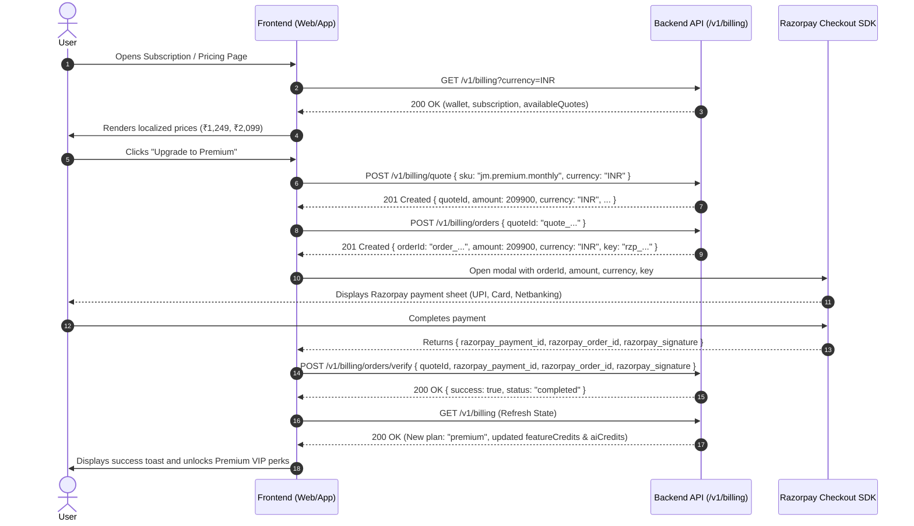

# Juicy Match — Frontend Developer Guide: Multi-Currency Pricing & Razorpay Integration

**Target Audience**: Frontend Engineering Team (Web, Mobile/React Native)  
**Status**: Active Production Standard  
**Last Updated**: October 2026  
**Related Endpoints**: `/v1/billing`, `/v1/billing/catalog`, `/v1/billing/quote`, `/v1/billing/orders`, `/v1/billing/orders/verify`

---

## 1. Executive Summary & What Changed

To provide a localized global experience and eliminate pricing bugs, the backend has implemented **dynamic multi-currency pricing**, **automated geo-currency detection**, and **guaranteed subunit precision for Razorpay orders**.

### Key Changes:
1. **No More Hardcoded USD or Inaccurate Currency Symbols**:
   - The backend detects user currency automatically via Geo-IP headers (`X-User-Country`, `CF-IPCountry`), user account profile, or `Accept-Language`.
   - The frontend can also explicitly request or switch currencies via `?currency=INR` (or `USD`, `EUR`, `GBP`, `AED`, `CAD`, `AUD`).
2. **Subunit Bug Eliminated (Paise vs Cents)**:
   - Razorpay expects amounts in the smallest currency subunit (`124900` paise for ₹1,249; `1499` cents for $14.99).
   - Order creation now strictly uses backend subunit calculations—eliminating the previous bug where a ₹1,249 plan was mistakenly charged as ₹12.49 (1249 paise).
3. **15-Minute Locked Price Quotes**:
   - Before charging, the frontend requests a quote (`POST /v1/billing/quote`).
   - This returns a locked `quoteId`, pre-calculated `amount` (subunits integer), `price` (decimal), and `formattedPrice` (e.g. `"₹1,249"` or `"$14.99"`).
4. **Synchronized Subscription & Credit State**:
   - `GET /v1/billing` returns top-level synchronized subscription details (`planKey`, `name`, `status`, `expiresAt`, `autoRenew`) and wallet credit balances (`featureCredits`, `aiCredits`, `balance`).

---

## 2. Supported Currencies & Regional Pricing Matrix

The backend supports live exchange rates for all global currencies via `https://api.exchangerate.fun/latest` with in-memory caching. Tier-1 markets have optimized regional matrix pricing:

| Plan / SKU | USD ($) | INR (₹) | EUR (€) | GBP (£) | AED (AED) | CAD ($) | AUD ($) |
| :--- | :---: | :---: | :---: | :---: | :---: | :---: | :---: |
| **Connect Monthly** (`jm.connect.monthly`) | $14.99 | ₹1,249 | €13.99 | £11.99 | AED 55 | $19.99 | $22.99 |
| **Connect Quarterly** (`jm.connect.quarterly`) | $34.99 | ₹2,999 | €32.99 | £27.99 | AED 129 | $46.99 | $52.99 |
| **Premium VIP Monthly** (`jm.premium.monthly`) | $24.99 | ₹2,099 | €22.99 | £19.99 | AED 89 | $32.99 | $37.99 |
| **Premium VIP Quarterly** (`jm.premium.quarterly`) | $59.99 | ₹4,999 | €54.99 | £47.99 | AED 219 | $79.99 | $89.99 |
| **100 Feature Credits** (`credits.feature.100`) | $1.99 | ₹169 | €1.89 | £1.59 | AED 7.50 | $2.69 | $2.99 |
| **500 Feature Credits** (`credits.feature.500`) | $8.99 | ₹749 | €8.49 | £6.99 | AED 33 | $11.99 | $13.99 |
| **1000 Feature Credits** (`credits.feature.1000`) | $15.99 | ₹1,349 | €14.99 | £12.99 | AED 59 | $21.99 | $24.99 |
| **2500 Feature Credits** (`credits.feature.2500`) | $34.99 | ₹2,999 | €32.99 | £27.99 | AED 129 | $46.99 | $52.99 |
| **50 AI Credits** (`credits.ai.50`) | $2.99 | ₹249 | €2.79 | £2.39 | AED 11 | $3.99 | $4.59 |
| **150 AI Credits** (`credits.ai.150`) | $7.99 | ₹669 | €7.49 | £6.29 | AED 29 | $10.99 | $12.49 |
| **200 AI Credits** (`credits.ai.200`) | $9.99 | ₹849 | €9.49 | £7.99 | AED 37 | $13.49 | $15.49 |
| **400 AI Credits** (`credits.ai.400`) | $17.99 | ₹1,499 | €16.99 | £14.49 | AED 66 | $24.49 | $27.99 |

> **Note on SKUs**: Both frontend standard SKUs (`jm.connect.monthly`, `jm.premium.monthly`, etc.) and legacy SKUs (`connect.month`, `premium.month`) are fully supported by the backend.

---

## 3. End-to-End Checkout Sequence



---

## 4. API Endpoints Specification

### 4.1. Get Billing Status & Catalog
Fetch the user's active plan, credits, and current catalog quotes in the requested currency.

- **Method**: `GET`
- **Path**: `/v1/billing`
- **Query Parameters**:
  - `currency` *(optional, string)*: 3-letter currency code (e.g. `INR`, `USD`, `EUR`, `GBP`, `AED`, `CAD`, `AUD`). If omitted, auto-detected from user's geo/profile.
- **Headers**:
  ```http
  Authorization: Bearer <user_jwt_token>
  Accept-Language: en-IN,en;q=0.9
  ```

#### Response (`200 OK`):
```json
{
  "plan": "explore",
  "subscription": {
    "planKey": "explore",
    "name": "Explore Free",
    "status": "active",
    "expiresAt": null,
    "autoRenew": false
  },
  "featureCredits": 50,
  "aiCredits": 5,
  "balance": 0,
  "currency": "INR",
  "availableQuotes": [
    {
      "sku": "jm.connect.monthly",
      "name": "Connect Monthly",
      "currency": "INR",
      "price": 1249,
      "amount": 124900,
      "formattedPrice": "₹1,249",
      "planKey": "connect",
      "terms": {
        "kind": "subscription",
        "plan": "connect",
        "months": 1,
        "featureCredits": 1000,
        "aiCredits": 100,
        "boosts": 3
      }
    },
    {
      "sku": "jm.premium.monthly",
      "name": "Premium VIP Monthly",
      "currency": "INR",
      "price": 2099,
      "amount": 209900,
      "formattedPrice": "₹2,099",
      "planKey": "premium",
      "terms": {
        "kind": "subscription",
        "plan": "premium",
        "months": 1,
        "featureCredits": 2500,
        "aiCredits": 250,
        "boosts": 8
      }
    },
    {
      "sku": "credits.feature.1000",
      "name": "1,000 Feature Credits",
      "currency": "INR",
      "price": 1349,
      "amount": 134900,
      "formattedPrice": "₹1,349",
      "planKey": "topup",
      "terms": {
        "kind": "credit_topup",
        "creditType": "feature",
        "amount": 1000,
        "bonus": 150
      }
    }
  ],
  "wallet": {
    "featureCredits": 50,
    "aiCredits": 5,
    "balance": 0
  },
  "history": [],
  "ledger": []
}
```

---

### 4.2. Request 15-Minute Price Locked Quote
Locks the price for 15 minutes to prevent price changes while the user completes payment.

- **Method**: `POST`
- **Path**: `/v1/billing/quote`
- **Headers**:
  ```http
  Authorization: Bearer <user_jwt_token>
  Content-Type: application/json
  ```
- **Request Body**:
  ```json
  {
    "sku": "jm.premium.monthly",
    "currency": "INR"
  }
  ```
  *(Note: You can also pass `"plan": "premium"` or `"planKey": "premium"` if not specifying `sku`)*.

#### Response (`201 Created`):
```json
{
  "id": "quote_4b7edbec1f",
  "quoteId": "quote_4b7edbec1f",
  "sku": "jm.premium.monthly",
  "name": "Premium VIP Monthly",
  "currency": "INR",
  "price": 2099,
  "amount": 209900,
  "formattedPrice": "₹2,099",
  "exponent": 2,
  "terms": {
    "kind": "subscription",
    "plan": "premium",
    "planId": "00000000-0000-0000-0000-000000000003",
    "months": 1,
    "featureCredits": 2500,
    "aiCredits": 250,
    "boosts": 8
  },
  "expiresAt": "2026-10-10T15:37:18.530Z"
}
```

#### Error Response (`422 Unprocessable Entity`):
If an invalid SKU or plan name is submitted:
```json
{
  "error": "Invalid SKU or plan 'super_vip'. Expected one of: connect.month, connect.quarter, premium.month, premium.quarter, jm.connect.monthly, jm.connect.quarterly, jm.premium.monthly, jm.premium.quarterly, jm.explore.free, plus.month, plus.quarter, credits.feature.100, credits.feature.500, credits.feature.1000, credits.feature.1500, credits.feature.2500, credits.ai.50, credits.ai.150, credits.ai.200, credits.ai.400, boost.1, boost.3, boost.5, passport.1, passport.7, passport.30, pack.profiles.10, pack.likes.10"
}
```

---

### 4.3. Create Razorpay Order
Generates an official Razorpay order matching the exact subunit amount of the locked quote.

- **Method**: `POST`
- **Path**: `/v1/billing/orders`
- **Headers**:
  ```http
  Authorization: Bearer <user_jwt_token>
  Content-Type: application/json
  ```
- **Request Body**:
  ```json
  {
    "quoteId": "quote_4b7edbec1f"
  }
  ```

#### Response (`201 Created`):
```json
{
  "orderId": "order_PKy7b0vGj2d81q",
  "amount": 209900,
  "currency": "INR",
  "key": "rzp_test_51AbcDefGhIjKl",
  "quoteId": "quote_4b7edbec1f"
}
```

> **CRITICAL**: The `amount` returned is in subunits (e.g. `209900` for ₹2,099). You MUST pass this exact `amount` and `currency` directly to the Razorpay options.

#### Error Response (`400 Bad Request` - Expired Quote):
```json
{
  "error": "Quote expired. Please refresh pricing and try again."
}
```

---

### 4.4. Verify Razorpay Payment & Grant Entitlements
Submits the cryptographic signature generated by Razorpay. The backend verifies the HMAC SHA-256 signature, upgrades the user's plan, awards bonus credits/boosts, and sends an email invoice.

- **Method**: `POST`
- **Path**: `/v1/billing/orders/verify`
- **Headers**:
  ```http
  Authorization: Bearer <user_jwt_token>
  Content-Type: application/json
  ```
- **Request Body**:
  ```json
  {
    "quoteId": "quote_4b7edbec1f",
    "razorpay_order_id": "order_PKy7b0vGj2d81q",
    "razorpay_payment_id": "pay_PKy8c1wHk3e92r",
    "razorpay_signature": "9efb4c278a5b821415dfc37...8a7"
  }
  ```

#### Response (`200 OK`):
```json
{
  "success": true,
  "status": "completed"
}
```

#### Error Response (`400 Bad Request`):
```json
{
  "error": "Invalid payment signature"
}
```

---

## 5. Frontend Implementation Code Examples

### 5.1. Razorpay SDK Script Loading (Web / React)

Ensure the Razorpay checkout script is loaded into `index.html` or dynamically:
```html
<script src="https://checkout.razorpay.com/v1/checkout.js"></script>
```

Or via React hook:
```typescript
export const loadRazorpayScript = (): Promise<boolean> => {
  return new Promise((resolve) => {
    if (window.Razorpay) {
      resolve(true);
      return;
    }
    const script = document.createElement('script');
    script.src = 'https://checkout.razorpay.com/v1/checkout.js';
    script.onload = () => resolve(true);
    script.onerror = () => resolve(false);
    document.body.appendChild(script);
  });
};
```

---

### 5.2. Complete React Checkout Hook (`useJuicyCheckout.ts`)

```typescript
import { useState } from 'react';
import axios from 'axios';

interface CheckoutOptions {
  sku: string;
  currency?: string;
  userEmail?: string;
  userName?: string;
  userPhone?: string;
  onSuccess: (updatedBilling: any) => void;
  onError: (errorMsg: string) => void;
}

export const useJuicyCheckout = () => {
  const [isLoading, setIsLoading] = useState(false);

  const startCheckout = async ({
    sku,
    currency = 'INR',
    userEmail,
    userName,
    userPhone,
    onSuccess,
    onError,
  }: CheckoutOptions) => {
    setIsLoading(true);

    try {
      const token = localStorage.getItem('jwt_token');
      const authHeaders = { Authorization: `Bearer ${token}` };

      // Step 1: Request 15-minute locked quote
      const quoteRes = await axios.post(
        '/v1/billing/quote',
        { sku, currency },
        { headers: authHeaders }
      );
      const quote = quoteRes.data;

      // Step 2: Create Razorpay order from the quote
      const orderRes = await axios.post(
        '/v1/billing/orders',
        { quoteId: quote.quoteId },
        { headers: authHeaders }
      );
      const order = orderRes.data;

      // Step 3: Configure Razorpay Checkout modal
      const options = {
        key: order.key,
        amount: order.amount, // Exact subunit amount from backend (e.g. 209900)
        currency: order.currency, // e.g. "INR" or "USD"
        name: 'Juicy Match',
        description: quote.name,
        order_id: order.orderId,
        prefill: {
          name: userName || '',
          email: userEmail || '',
          contact: userPhone || '',
        },
        theme: {
          color: '#E11D48', // Juicy Match rose-600 brand color
        },
        handler: async function (response: {
          razorpay_order_id: string;
          razorpay_payment_id: string;
          razorpay_signature: string;
        }) {
          try {
            // Step 4: Verify signature with backend
            const verifyRes = await axios.post(
              '/v1/billing/orders/verify',
              {
                quoteId: quote.quoteId,
                razorpay_order_id: response.razorpay_order_id,
                razorpay_payment_id: response.razorpay_payment_id,
                razorpay_signature: response.razorpay_signature,
              },
              { headers: authHeaders }
            );

            if (verifyRes.data.success) {
              // Step 5: Refresh global billing state to update UI badges immediately
              const updatedBillingRes = await axios.get('/v1/billing', {
                headers: authHeaders,
              });
              onSuccess(updatedBillingRes.data);
            } else {
              onError('Payment verification was not completed.');
            }
          } catch (err: any) {
            onError(err.response?.data?.error || 'Payment verification failed.');
          } finally {
            setIsLoading(false);
          }
        },
        modal: {
          ondismiss: function () {
            setIsLoading(false);
          },
        },
      };

      const razorpayInstance = new (window as any).Razorpay(options);
      razorpayInstance.on('payment.failed', function (failureResponse: any) {
        setIsLoading(false);
        onError(failureResponse.error.description || 'Payment failed.');
      });

      razorpayInstance.open();
    } catch (err: any) {
      setIsLoading(false);
      onError(err.response?.data?.error || 'Failed to initiate order.');
    }
  };

  return { startCheckout, isLoading };
};
```

---

### 5.3. Currency Switcher Component Pattern

```tsx
import React from 'react';

const SUPPORTED_CURRENCIES = [
  { code: 'USD', symbol: '$', label: 'USD ($)' },
  { code: 'INR', symbol: '₹', label: 'INR (₹)' },
  { code: 'EUR', symbol: '€', label: 'EUR (€)' },
  { code: 'GBP', symbol: '£', label: 'GBP (£)' },
  { code: 'AED', symbol: 'AED', label: 'AED (AED)' },
  { code: 'CAD', symbol: '$', label: 'CAD ($)' },
  { code: 'AUD', symbol: '$', label: 'AUD ($)' },
];

export const CurrencySelector: React.FC<{
  currentCurrency: string;
  onSelectCurrency: (code: string) => void;
}> = ({ currentCurrency, onSelectCurrency }) => {
  return (
    <select
      value={currentCurrency}
      onChange={(e) => onSelectCurrency(e.target.value)}
      className="bg-neutral-800 text-white rounded-lg px-3 py-1.5 text-sm border border-neutral-700 focus:outline-none focus:border-rose-500"
    >
      {SUPPORTED_CURRENCIES.map((c) => (
        <option key={c.code} value={c.code}>
          {c.label}
        </option>
      ))}
    </select>
  );
};
```

When the user selects a new currency:
```typescript
const handleCurrencyChange = async (newCurrency: string) => {
  setCurrency(newCurrency);
  // Re-fetch billing & quotes with ?currency= param
  const res = await axios.get(`/v1/billing?currency=${newCurrency}`, {
    headers: { Authorization: `Bearer ${token}` }
  });
  setBillingData(res.data);
};
```

---

## 6. Critical Do's and Don'ts

| Do | Don't |
| :--- | :--- |
| **DO** pass `quoteId` to `/v1/billing/orders` so the backend controls the exact subunit amount. | **DON'T** manually multiply prices by 100 on the client side—the backend handles currency exponents automatically. |
| **DO** display `formattedPrice` (e.g. `"₹1,249"`, `"$14.99"`) directly from the backend catalog response. | **DON'T** hardcode symbols like `$ ` next to regional amounts (e.g. `₹` with `$1,249`). |
| **DO** refresh `/v1/billing` immediately after `/v1/billing/orders/verify` succeeds to update subscription status, VIP badge, and credits. | **DON'T** rely on local state speculation—the backend returns the source of truth in `plan`, `subscription`, and `featureCredits`. |
| **DO** handle the `ondismiss` modal callback so loading spinners stop if the user closes the payment sheet without paying. | **DON'T** leave the UI in an un-clickable loading state when Razorpay is dismissed. |
| **DO** handle 400 Bad Request (`"Quote expired..."`) by re-fetching quotes if a user idles for over 15 minutes before clicking checkout. | **DON'T** retry with the same expired `quoteId`. |

---

## 7. Troubleshooting & FAQ

#### Q: Why did Razorpay charge 1249 paise instead of ₹1249 previously?
> Razorpay treats the `amount` field as smallest currency units (subunits). For INR, ₹1 = 100 paise. Under the old code, sending `amount: 14.99` or `amount: 1249` charged 1249 paise (₹12.49). With the new implementation, the backend calculates `amount: 124900` paise automatically. The frontend does not need to calculate math—just pass `order.amount` directly.

#### Q: How does the backend know what currency to use if the user didn't pick one?
> The backend inspects incoming headers in order:
> 1. `?currency=` query parameter or payload
> 2. `X-User-Country` or `CF-IPCountry` geo-IP headers (e.g. `IN` $\rightarrow$ `INR`, `GB` $\rightarrow$ `GBP`, `AE` $\rightarrow$ `AED`)
> 3. Account country stored in user profile
> 4. `Accept-Language` header
> 5. Default `USD`

#### Q: How does credit top-up differ from plan subscription?
> Subscription SKUs (`jm.connect.monthly`, `jm.premium.monthly`) upgrade `subscription.planKey`, increase boost counts, and allocate monthly feature/AI credits.  
> Top-up SKUs (`credits.feature.1000`, `credits.ai.150`) directly append credits and any bonus credits to the user's wallet without altering subscription plan or expiry date.

---

## 8. Summary Checklist for Frontend QA

- [ ] Change currency to `INR` $\rightarrow$ verify all plan prices show in `₹` (e.g. `₹1,249` and `₹2,099`).
- [ ] Change currency to `USD` $\rightarrow$ verify prices show in `$` (e.g. `$14.99` and `$24.99`).
- [ ] Change currency to `EUR` $\rightarrow$ verify prices show in `€` (e.g. `€13.99` and `€22.99`).
- [ ] Click "Upgrade" $\rightarrow$ confirm `POST /v1/billing/quote` returns `201` with `quoteId` and matching subunit `amount`.
- [ ] Confirm Razorpay opens with exact localized amount and currency in the header.
- [ ] Complete payment in Razorpay test mode $\rightarrow$ confirm `POST /v1/billing/orders/verify` returns `success: true`.
- [ ] Confirm `GET /v1/billing` returns updated `plan: "premium"`, updated `featureCredits`, and updated `aiCredits`.
- [ ] Test modal dismissal (closing without paying) $\rightarrow$ confirm UI returns to normal interactive state.
