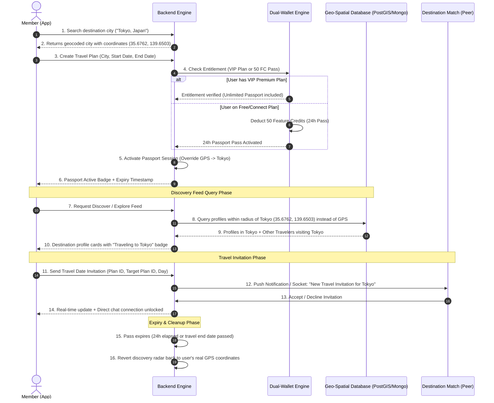

# Juicy Match — Passport & Travel Module: End-to-End Flow & Backend Architectural Guide

> **Document Type**: Architecture & Engineering Specification  
> **Target Audience**: Backend Developers, System Architects, Product Team  
> **Status**: Approved Production Design  
> **Date**: October 2026  

---

## 1. What is the Passport Module?

The **Passport Module** (also known as *Travel Mode* or *Virtual Teleportation*) is a premium discovery feature that allows members to virtually change their geographic location to any destination city or country worldwide.

### Why It Matters:
Normally, Juicy Match matches users within a physical GPS radius (e.g., 25–100 km). With **Passport Mode**, users can:
1. **Plan Ahead for Trips**: Connect, chat, and schedule meetups with locals and fellow travelers in Paris, New York, Tokyo, Dubai, or Mumbai days or weeks before hopping on a plane.
2. **Overlapping Travel Matching**: Find other members who are traveling to the exact same city on the exact same dates.
3. **Travel Date Invitations**: Send direct travel rendezvous proposals (e.g., *"Coffee near the Louvre on Saturday"*).

---

## 2. End-to-End System Flow (Mermaid Sequence)



---

## 3. Step-by-Step Lifecycle & Backend Business Logic

### Phase 1: Destination Geocoding & City Resolution
1. **Input**: User types a city name or selects a pin on the interactive world map.
2. **Backend Logic**:
   - Matches against a standardized places database or geocoding service (e.g., GeoNames, OpenStreetMap Nominatim, or Google Places).
   - Resolves canonical name: `name: "Tokyo"`, `country: "Japan"`, `latitude: 35.6762`, `longitude: 139.6503`.
   - Returns place metadata to the client so coordinates are consistent across all platforms.

---

### Phase 2: Plan Creation & Entitlement Verification
When the user creates a travel plan with `city`, `startDate`, and `endDate`:

1. **Active Travel Plan Record**:
   - Backend saves a record in `travel_plans` table.
   - Status: `active` or `scheduled` (if startDate is in the future).
2. **Entitlement Rule (Dual-Wallet Integration)**:
   - **Condition A (VIP Premium Subscriber)**: If the user's active plan is `premium`, Passport is **100% free and unlimited**. The plan is activated immediately with zero credit charge.
   - **Condition B (Connect or Free Explorer)**: If not a VIP subscriber, the backend checks if the user has an active 24-hour pass (`passport_pass`). If none exists, the backend verifies if the user has at least **50 Feature Credits (FC)**:
     - If yes: Deducts 50 FC via the FEFO wallet engine and generates a 24-hour expiration token (`expiresAt = now + 24 hours`).
     - If no: Returns HTTP `402 Payment Required` with `reason: "insufficient_feature_credits"`.

---

### Phase 3: Virtual Teleportation (Geo-Spatial Query Override)
This is the **core matching logic** that makes Passport work:

1. **Normal Flow (Without Passport)**:
   When user calls `GET /v1/discover` or `GET /v1/explore`:
   ```sql
   -- Standard query using physical GPS
   ST_DWithin(user_location, ST_MakePoint(real_user_lng, real_user_lat)::geography, max_distance_meters)
   ```
2. **Passport Active Flow**:
   When user has an active Passport session:
   - The backend **overrides the user's discovery anchor coordinates** with the destination city's coordinates:
     `effective_lat = target_city_lat`  
     `effective_lng = target_city_lng`
   - The candidate pool now includes:
     a) **Local Residents**: Users whose physical location is within the radius of that city.
     b) **Overlapping Travelers**: Other users with an active travel plan in the same destination city whose date ranges overlap (`user_start <= peer_end AND user_end >= peer_start`).
3. **Privacy & Safe Distance Protection**:
   - Never reveal the exact hotel or GPS coordinates of traveling members.
   - Apply a randomized jitter of 1.5–3 km to the displayed distance badge (e.g., display *"In Paris"* or *"3 km away"* instead of exact pinpoints).

---

### Phase 4: Overlapping Trip Matching & Travel Invitations
1. **Overlap Detection**:
   When two members are both traveling to Barcelona between October 15 and October 20:
   - Their profile cards display a highlighted banner: **"✈️ Also visiting Barcelona (Oct 15 - 20)"**.
2. **Travel Date Invitations**:
   - Member A can propose an activity: *"Drinks in Shibuya on Friday evening"*.
   - Backend stores this in `travel_invitations` with states: `pending`, `accepted`, `declined`, `expired`.
   - When Member B accepts:
     - Both members are instantly linked into an active chat connection.
     - A calendar prompt is generated with the meeting time/location.

---

### Phase 5: Expiration, Revocation & Reversion to GPS
1. **Single Active Passport Constraint**:
   A user can only be teleported to **one city at a time**. Activating a new city automatically deactivates the previous session.
2. **Automatic Session Expiry**:
   - For 24-hour credit passes: When `expiresAt <= now()`, the active session flag is cleared.
   - For scheduled trips: When `endDate` passes 23:59:59 in the target city's timezone, the plan transitions to `completed`.
3. **Reversion**:
   The very next time `GET /v1/discover` is called, the query automatically reverts to the user's real GPS device coordinates without requiring an app restart.

---

## 4. Backend Database Schema Design

### 4.1. Table: `travel_plans`
Stores all historical, active, and upcoming trips planned by members.

```sql
CREATE TABLE travel_plans (
    id UUID PRIMARY KEY DEFAULT gen_random_uuid(),
    user_id UUID NOT NULL REFERENCES members(id) ON DELETE CASCADE,
    city_name VARCHAR(120) NOT NULL,
    country_name VARCHAR(120) NOT NULL,
    latitude DOUBLE PRECISION NOT NULL,
    longitude DOUBLE PRECISION NOT NULL,
    start_date DATE NOT NULL,
    end_date DATE NOT NULL,
    visibility VARCHAR(30) DEFAULT 'city', -- 'city', 'all', 'connections_only'
    status VARCHAR(30) DEFAULT 'active',   -- 'active', 'scheduled', 'completed', 'cancelled'
    created_at TIMESTAMP WITH TIME ZONE DEFAULT NOW(),
    updated_at TIMESTAMP WITH TIME ZONE DEFAULT NOW()
);

CREATE INDEX idx_travel_plans_user ON travel_plans(user_id);
CREATE INDEX idx_travel_plans_active_city ON travel_plans(city_name, status);
CREATE INDEX idx_travel_plans_dates ON travel_plans(start_date, end_date);
```

### 4.2. Table: `passport_sessions`
Tracks the currently active teleportation anchor and credit pass duration.

```sql
CREATE TABLE passport_sessions (
    user_id UUID PRIMARY KEY REFERENCES members(id) ON DELETE CASCADE,
    travel_plan_id UUID REFERENCES travel_plans(id) ON DELETE SET NULL,
    target_city VARCHAR(120) NOT NULL,
    target_country VARCHAR(120) NOT NULL,
    latitude DOUBLE PRECISION NOT NULL,
    longitude DOUBLE PRECISION NOT NULL,
    pass_source VARCHAR(30) NOT NULL, -- 'vip_subscription', 'feature_credits_24h'
    activated_at TIMESTAMP WITH TIME ZONE DEFAULT NOW(),
    expires_at TIMESTAMP WITH TIME ZONE, -- NULL for continuous VIP subscription
    is_active BOOLEAN DEFAULT TRUE
);
```

### 4.3. Table: `travel_invitations`
Stores social invitations proposed between traveling members.

```sql
CREATE TABLE travel_invitations (
    id UUID PRIMARY KEY DEFAULT gen_random_uuid(),
    sender_id UUID NOT NULL REFERENCES members(id) ON DELETE CASCADE,
    receiver_id UUID NOT NULL REFERENCES members(id) ON DELETE CASCADE,
    plan_id UUID NOT NULL REFERENCES travel_plans(id),
    target_plan_id UUID NOT NULL REFERENCES travel_plans(id),
    destination_city VARCHAR(120) NOT NULL,
    proposed_date DATE NOT NULL,
    status VARCHAR(30) DEFAULT 'pending', -- 'pending', 'accepted', 'declined', 'expired'
    message TEXT,
    created_at TIMESTAMP WITH TIME ZONE DEFAULT NOW(),
    updated_at TIMESTAMP WITH TIME ZONE DEFAULT NOW()
);

CREATE INDEX idx_travel_invites_receiver ON travel_invitations(receiver_id, status);
```

---

## 5. Required Backend Route Handlers

| Route | Method | Purpose & Business Logic |
| :--- | :--- | :--- |
| `/v1/places/search?q=:query` | `GET` | Autocomplete search for world cities with country, lat, and lon. |
| `/v1/passport` | `GET` | Retrieves the user's travel plans, current active passport session, and pass expiry. |
| `/v1/passport` | `POST` | Creates a travel plan, checks VIP/50 FC entitlement, activates virtual teleportation. |
| `/v1/passport/:id` | `DELETE` | Cancels a travel plan and clears the active passport session (reverting to GPS). |
| `/v1/passport/:id/visibility` | `PATCH` | Updates privacy settings (e.g. hide from home town or show only to mutual connections). |
| `/v1/passport/:id/discover` | `GET` | Fetches discovery matches specifically anchored to this destination plan. |
| `/v1/passport/invitations` | `GET` | Fetches incoming and outgoing travel date invitations. |
| `/v1/passport/invitations` | `POST` | Sends a travel meetup proposal for an overlapping trip date. |
| `/v1/passport/invitations/:id/action` | `POST` | Accepts or declines a travel date proposal (`{ action: "accept" \| "decline" }`). |

---

## 6. Safety, Moderation & Trust Guidelines

1. **Home Town Concealment**:
   Members should have the option: *"Hide my passport activity from users in my home GPS city"*, so friends/family back home do not see their travel search profile.
2. **Anti-Scam & Bot Prevention**:
   Rapid teleportation jumping across 5 continents in 10 minutes should trigger a velocity rate-limit flag (potential account compromise or scraper).
3. **Local Law Compliance**:
   Certain jurisdictions restrict specific matchmaking practices; the backend should enforce country-specific safety warnings when teleporting to restricted regions.
